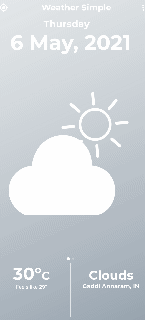
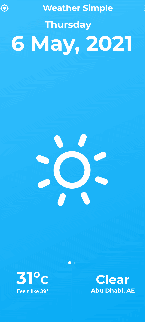
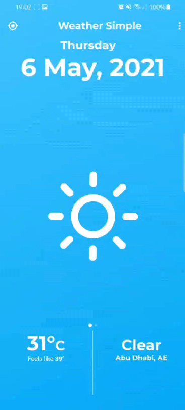

# weathersimple

A new and Simple Flutter Application that provides the user with the latest information in a captivating UI.

## Features
* Uses OpenWeatherMap API to query the weather data set.
* Dynamic Weather Updation according to the user's location
* Possible to search weather of other locations.
* Provies forecast of upto next 6 days and the sunrise and sunset times

## Screenshots

* Showing the Main Screen   

The screen shows a different color depending on the weather   
  

